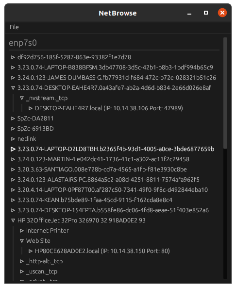

# NetBrowse
[](https://crates.io/crates/netbrowse) 
[](https://github.com/Ewpratten/netbrowse/actions/workflows/build.yml)
[](https://github.com/Ewpratten/netbrowse/actions/workflows/clippy.yml)


**NetBrowse** is a graphical frontend to [`avahi-browse`](https://linux.die.net/man/1/avahi-browse). This tool is used to quickly inspect a network for hosts that publicly expose their services.



*This screenshot was taken on a public network*

## Installation

[](https://github.com/Ewpratten/netbrowse/releases/latest)

This crate can also be installed via `cargo` with:

```sh
cargo install netbrowse
```
